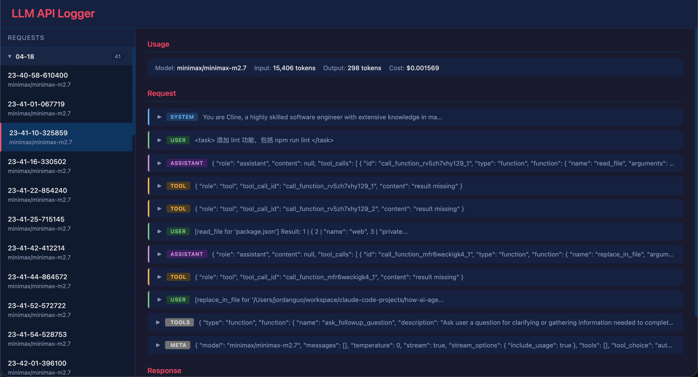

# LLM Requests Inspector

本项目是一个模型请求代理服务器，用于截取 AI 编程助手与大模型之间的交互数据，并将交互数据直观地呈现在 Web 页面上

## 截图



## 启动后台服务

```bash
# 使用 uv 管理项目
# https://docs.astral.sh/uv/
uv run python main.py # 俺的 python 版本是 3.13
```

## 启动 Web 服务

```bash
cd web
npm install
npm run dev # 俺使用了 volta 预设 node 环境，见 package.json
```

## 配置示例

### 配置访问端点

俺使用的是 OpenRouter 的 API 服务。见 `main.py`:

```py
COMPLETIONS_ENDPOINT = "https://openrouter.ai/api/v1/chat/completions"
MESSAGES_ENDPOINT = "https://openrouter.ai/api/v1/messages"
```

> API 参考：[/chat/completions](https://developers.openai.com/api/reference/resources/chat/subresources/completions/methods/create)、[/messages](https://platform.claude.com/docs/en/api/messages/create)

### Cline VSCode 扩展

```text
1. 选择 Api Provider 为 OpenAI Compatible
2. 填入 Base URL为：http://localhost:8000
3. 填入 Api Key
4. 填入 Model ID，比如 minimax/minimax-m2.7
5. 点击右上角 DONE
```

## 感谢

- [@MarkTechStation](https://github.com/MarkTechStation) 提供的 [llm_logger.py](https://github.com/MarkTechStation/VideoCode/blob/main/MCP%E7%BB%88%E6%9E%81%E6%8C%87%E5%8D%97-%E7%95%AA%E5%A4%96%E7%AF%87/llm_logger.py)
