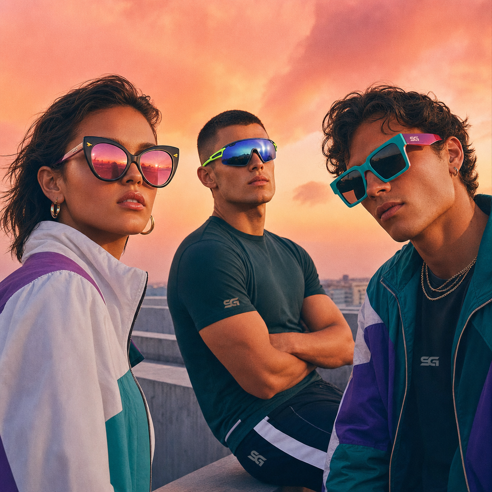

# 🕶️ Summer Sunglasses Campaign – Executive Summary

## 📊 Refined Trend Insights
Summer 2026 Eyewear Trends: Executive Summary

As we look ahead to Summer 2026, three distinct styles will define the season’s eyewear landscape. Each trend speaks to a different consumer need—statement-making glamour, high-performance functionality and confident retro revival. Our curated in-house catalog offers a perfect match for each, ensuring we capture every key segment.

1. Oversized “Butterfly” Silhouettes  
   – Market Insight: Consumers are gravitating toward dramatic, enveloping frames with softly swept outer corners—an elegant fusion of Jackie-O refinement and modern nightlife flair.  
   – Catalog Highlight: SG003 “Mystique”  
     • 1950s-inspired upswept acetate delivers bold volume without excess.  
     • Sculpted cat-eye effect that reads both vintage-chic and fashion-forward.  
   – Strategic Fit: Mystique answers the demand for a high-impact, statement-making piece that feels authentic rather than gimmicky.

2. Sporty Shield & Wraparound Styles  
   – Market Insight: Performance-driven consumers want full-coverage UV protection in a sleek, single-lens silhouette—blurring the lines between athletic gear and avant-garde fashion.  
   – Catalog Highlight: SG004 “Sport”  
     • One-piece curved lens with integrated rubber grips for secure, all-day wear.  
     • Lightweight, wind-resistant design engineered for active lifestyles.  
   – Strategic Fit: Sport captures the season’s functional-meets-futuristic ethos, appealing to both athletes and style-savvy adventurers.

3. Thick-Acetate Retro Revival  
   – Market Insight: The resurgence of ’80s/’90s chunky frames continues, driven by a desire for confident silhouettes and bold color-blocking.  
   – Catalog Highlight: SG002 “Wayfarer”  
     • Sturdy, angular acetate embodies the iconic chunky-frame trend.  
     • Versatile enough for everyday wear while making a definitive style statement.  
   – Strategic Fit: Wayfarer offers customers a reliable, fashion-forward staple that anchors our campaign’s retro-revival narrative.

By strategically featuring Mystique, Sport and Wayfarer, we cover the summer’s three highest-impact trends—oversized drama, performance-inspired shields and chunky nostalgia—ensuring our campaign resonates across all major consumer segments.

## 🎯 Campaign Visual

    

## ✍️ Campaign Quote
Statement Sunwear: Bold Glamour, Athletic Shield, Retro Attitude

## ✅ Why This Works
This line highlights the three key silhouettes shown—oversized cat-eye drama, performance-inspired wraparound, and chunky retro acetate—mirroring the image’s trio of models and the season’s top trends.

---

*Report generated on 2026-06-15*
