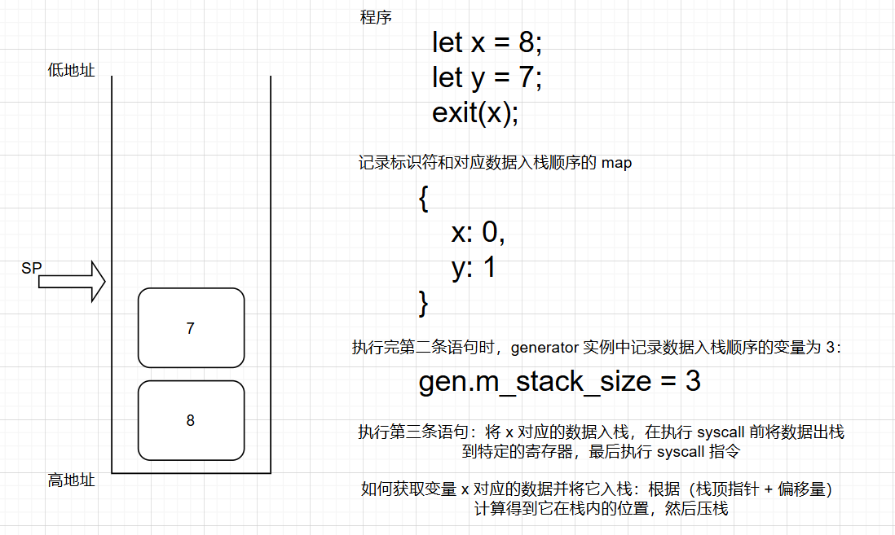

# build-a-compiler

[Creatig a compiler](https://www.youtube.com/playlist?list=PLUDlas_Zy_qC7c5tCgTMYq2idyyT241qs)
[Github](https://github.com/orosmatthew/hydrogen-cpp)

## 热身

了解 [NASM](https://nasm.us/) 及其简单使用

示例：使用 nasm 编译 asm 代码

`test.asm`

```asm
global _start
_start:
    mov rax, 60
    mov rdi, 69 ; custom your exit code here, 0-255
    syscall
```

`run.sh`

```sh
#!/bin/bash
nasm -felf64 test.asm
ld test.o -o test
./test
echo $?
```

参考：

- [x86 64 - Assembly registers in 64-bit architecture - Stack Overflow](https://stackoverflow.com/questions/20637569/assembly-registers-in-64-bit-architecture)

## 第一部分-demo

源代码 `test.hy`

```asm
return 60;
```

步骤

```sh
# 在 build 目录下进行构建
mkdir build && cd build

# 生成编译器
cmake .. && make

# 使用编译器：将 test.hy 解析为 out.asm，并用 nasm 生成可执行文件
./hydro /your/absolute/path/to/file/test.hy

# 执行
./out
echo $?
```

## 第二部分-exit 语句

解析内容：

```asm
exit 6;
```

对应的**生成式**（production rules）：（**生成式可以看成代码的语法**）

$$
\begin{align}
[\text{exit}] &\to \text{exit} \space [\text{expr}] ;
\\
[\text{expr}] &\to \text{int\_lit}
\end{align}
$$

本节内容：

**Tokenizer 类**，做词法分析。逻辑是将代码字符串解析为 Token 列表

**Parser 类**，做语法分析。逻辑是：遍历 `Tokenzier` 生成的每个 token，判断 token 类型是否是 exit，如果是那么按照生成式解析它；如果 token 没有遵守生成式语法，那么报错；如果不是 exit 类型则跳过

**Generation 类**，用来生成 asm 代码

## 第三部分-变量

本节内容：

1. 引入 let 语句，用于创建标识符
2. 使用变量
3. 修改 exit 语句的生成式：需要添加括号

生成式

$$
\begin{align}
    [\text{prog}] &\to [\text{stmt}]^* \\
    [\text{stmt}] &\to
    \begin{cases}
        \text{exit}([\text{expr}]); \\
        \text{let}\space\text{ident} = [\text{expr}];
    \end{cases} \\
    [\text{expr}] &\to
    \begin{cases}
        \text{int\_lit} \\
        \text{ident}
    \end{cases}
\end{align}
$$

示例

```asm
let x = 8;
let y = 7;
exit(x);
```

**第一阶段，定义变量，将数据压栈**

```asm
move rax 8;
push rax;
move rax 7;
push rax;
```

栈中的数据与位置指针（`m_stack_size`）的关系

```asm
8 7
0 1 2
```

**第二阶段，使用变量**

```assembly
; 如果第三条语句是 exit(y); 那么此时的偏移量为 0，即 [rsp + 0]
push QWORD [rsp + 8]
; 8 = (2 - 1 - 0) * 8
```

```asm
8 7 8
0 1 2 3
```

**第三阶段，系统调用，退出**

```assembly
mov rax, 60
pop rdi
syscall
```

示意图



总结：

- 定义变量：1将对应的数据压栈，2在 `generator` 中使用 map 记录变量标识符及其入栈次序
- 使用变量：1根据标识符找到它的入栈顺序并计算出偏移量，2根据（栈指针 + 偏移量）计算出栈内数据的地址并读取数据

参考：

- [C 内存结构](https://textbook.cs161.org/memory-safety/x86.html#23-c-memory-layout)

## 第四部分-加法

添加数字加法功能

修改生成式

$$
\begin{align}
    [\text{Prog}] &\to [\text{Stmt}]^* \\
    [\text{Stmt}] &\to
    \begin{cases}
        \text{exit}([\text{Expr}]); \\
        \text{let}\space\text{ident} = [\text{Expr}];
    \end{cases} \\
    [\text{Expr}] &\to
    \begin{cases}
        [\text{Term}] \\
        [\text{BinExpr}]
    \end{cases} \\
    [\text{BinExpr}] &\to
    \begin{cases}
    [\text{Expr}] * [\text{Expr}] & \text{prec} = 1 \\
        [\text{Expr}] + [\text{Expr}] & \text{prec} = 0 \\
    \end{cases} \\
    [\text{Term}] &\to
    \begin{cases}
        \text{int\_lit} \\
        \text{ident}
    \end{cases}
\end{align}
$$

内容：

- 创建 `ArenaAllocator` 内存管理类，用来管理的 `NodeExpr`、`NodeStmt`、`NodeTerm` 等结构体实例
- 改造 `Generator` 类，实现加法逻辑

示例：

```asm
let x = 8 + 2 + 1;
```

这条语句会被解析为 ast，其结构为：

```asm
    +
  /   \
8       +
      /   \
     2     1
```

根据 AST 生成汇编的伪代码：

```asm
fn gen_expr(e) {
	if (e is int_lit || e is ident) {
		return 'mov rax, e\npush rax'
	}

	// e is binary add expr with left expr and right expr
	let res = ''
	let left = gen_expr(e.left) // "finally push a number"
	let right = gen_expr(e.right) // "finally push a number, too"
	res += 'pop rax;'
	res += 'pop rbx;'
	res += 'add rax, rbx;'
	res += 'push rax;'
}
```

生成的汇编代码

```assembly
    mov rax, 8  ; '8+x' 开始
    push rax
    mov rax, 2                ;  '2+1' 开始
    push rax
    mov rax, 1
    push rax
    pop rax
    pop rbx
    add rax, rbx
    push rax                  ; '2+1' 结束
    pop rax
    pop rbx
    add rax, rbx
    push rax    ; '8+x' 结束
```

## 第五部分-算术

完善算数表达式，引入乘法、减法、除法和括号

内容：

- 添加乘法支持（解析表达式时需要考虑乘法和加法二者的优先级，参考[解析表达式之优先级攀爬](https://eli.thegreenplace.net/2012/08/02/parsing-expressions-by-precedence-climbing)）
- 添加除法、减法支持
- 添加括号支持

生成式

$$
\begin{align}
    [\text{Prog}] &\to [\text{Stmt}]^* \\
    [\text{Stmt}] &\to
    \begin{cases}
        \text{exit}([\text{Expr}]); \\
        \text{let}\space\text{ident} = [\text{Expr}];
    \end{cases} \\
    [\text{Expr}] &\to
    \begin{cases}
        [\text{Term}] \\
        [\text{BinExpr}]
    \end{cases} \\
    [\text{BinExpr}] &\to
    \begin{cases}
        [\text{Expr}] * [\text{Expr}] & \text{prec} = 1 \\
        [\text{Expr}] \space / \space [\text{Expr}] & \text{prec} = 1 \\
        [\text{Expr}] + [\text{Expr}] & \text{prec} = 0 \\
        [\text{Expr}] - [\text{Expr}] & \text{prec} = 0 \\
    \end{cases} \\
    [\text{Term}] &\to
    \begin{cases}
        \text{int\_lit} \\
        \text{ident} \\
        ([\text{Expr}])
    \end{cases}
\end{align}
$$

## 第六部分-作用域和 if 语句

先添加作用域解析功能；再添加 if 语句解析功能

$$
\begin{align}
    [\text{Prog}] &\to [\text{Stmt}]^* \\
    [\text{Stmt}] &\to
    \begin{cases}
        \text{exit}([\text{Expr}]); \\
        \text{let}\space\text{ident} = [\text{Expr}]; \\
        \text{if} ([\text{Expr}])[\text{Scope}]\\
        [\text{Scope}]
    \end{cases} \\
    \text{[Scope]} &\to \{[\text{Stmt}]^*\} \\
    [\text{Expr}] &\to
    \begin{cases}
        [\text{Term}] \\
        [\text{BinExpr}]
    \end{cases} \\
    [\text{BinExpr}] &\to
    \begin{cases}
        [\text{Expr}] * [\text{Expr}] & \text{prec} = 1 \\
        [\text{Expr}] \space / \space [\text{Expr}] & \text{prec} = 1 \\
        [\text{Expr}] + [\text{Expr}] & \text{prec} = 0 \\
        [\text{Expr}] - [\text{Expr}] & \text{prec} = 0 \\
    \end{cases} \\
    [\text{Term}] &\to
    \begin{cases}
        \text{int\_lit} \\
        \text{ident} \\
        ([\text{Expr}])
    \end{cases}
\end{align}
$$

**作用域**

解析原理：创建“变量表”记录已经定义的变量，出现同名变量时报错；内层作用域可以使用在外层作用域中已经定义的变量

局限：变量名不可重复（全局），即没有实现 shadow 功能

**if 语句**

逻辑：如果表达式不为 0 那么执行 if 语句块中的语句，反之则跳过 if 语句块继续向下执行

条件判断及跳转原理，[jz 指令示例](https://www.aldeid.com/wiki/X86-assembly/Instructions/jz)

```assembly
test eax, eax     ; test if eax=0
jz  loc_402B13    ; if condition is met, jump to loc_402B13
```

## 第七部分-注释和 elif 和 else

**注释**

- 单行注释，以 `//` 开始
- 多行注释，以 `/*` 开始，以 `*/` 结束。允许未闭合的多行注释，但注释块必须放在文件末尾

**elif 和 else**

if 语句的同级别分支是不确定的，可能有多个 elif 分支、可能有一个 else 分支

If 语句和 elif 语句的预测语句可能包含三种情况：elif、else、空

生成式⭐

$$
\begin{align}
    [\text{Prog}] &\to [\text{Stmt}]^* \\
    [\text{Stmt}] &\to
    \begin{cases}
        \text{exit}([\text{Expr}]); \\
        \text{let}\space\text{ident} = [\text{Expr}]; \\
        \text{if} ([\text{Expr}])[\text{Scope}]\text{[IfPred]}\\
        [\text{Scope}]
    \end{cases} \\
    \text{[Scope]} &\to \{[\text{Stmt}]^*\} \\
    \text{[IfPred]} &\to
    \begin{cases}
        \text{elif}(\text{[Expr]})\text{[Scope]}\text{[IfPred]} \\
        \text{else}\text{[Scope]} \\
        \epsilon
    \end{cases} \\
    [\text{Expr}] &\to
    \begin{cases}
        [\text{Term}] \\
        [\text{BinExpr}]
    \end{cases} \\
    [\text{BinExpr}] &\to
    \begin{cases}
        [\text{Expr}] * [\text{Expr}] & \text{prec} = 1 \\
        [\text{Expr}] \space / \space [\text{Expr}] & \text{prec} = 1 \\
        [\text{Expr}] + [\text{Expr}] & \text{prec} = 0 \\
        [\text{Expr}] - [\text{Expr}] & \text{prec} = 0 \\
    \end{cases} \\
    [\text{Term}] &\to
    \begin{cases}
        \text{int\_lit} \\
        \text{ident} \\
        ([\text{Expr}])
    \end{cases}
\end{align}
$$

本项目中使用的跳转指令及其用法：

- `jz`：指定的寄存器为 0 时跳转到“下一个分支”代码对应的 label；不为零时不跳转，继续执行作用域中的代码
- `jmp`：执行完 if 分支或 elif 分支的作用域代码后，需要无条件跳转到所有分支后的代码执行

示例

```assembly
;...
if(1) {
    if_scope
} elif (1) {
    elif_scope
} else {
    else_scope
}
let z = 3;

----------------------------------
main:
    ;...
    ;if(1) {} 分支代码
    text rax, rax
    jz label0  // 指定的寄存器为 0 时跳转到“下一个分支”代码对应的 label
    if_scope asm code
    jmp label1_end // 执行完 if 分支或 elif 分支的作用域代码后，需要无条件跳转到所有分支后的代码执行

label0:
    ;elif(1) {} 分支代码
    text rax, rax
    jz label2 // 指定的寄存器为 0 时跳转到“下一个分支”代码对应的 label
    elif_scope asm code
    jmp label1_end // 执行完 if 分支或 elif 分支的作用域代码后，需要无条件跳转到所有分支后的代码执行

label2:
	;else {} 分支代码
    else_scope asm code // 如果是 else 分支那么不进行条件跳转，而是直接执行作用域代码

label1_end: // 所有分支后的代码
    asm code of "let z = 3;"
```

## 第八部分-赋值语句

**为 asm 代码添加注释**

一个 test.hy 和 out.asm 示例，见 `example_of_part8` 目录

**添加赋值语句**

在生成式的描述中多了一个**子 Stmt**：`ident = [Expr];`

$$
\begin{align}
    [\text{Prog}] &\to [\text{Stmt}]^* \\
    [\text{Stmt}] &\to
    \begin{cases}
        \text{exit}([\text{Expr}]); \\
        \text{let}\space\text{ident} = [\text{Expr}]; \\
        \text{ident} = [\text{Expr}]; \\
        \text{if} ([\text{Expr}])[\text{Scope}]\text{[IfPred]}\\
        [\text{Scope}]
    \end{cases} \\
    \text{[Scope]} &\to \{[\text{Stmt}]^*\} \\
    \text{[IfPred]} &\to
    \begin{cases}
        \text{elif}(\text{[Expr]})\text{[Scope]}\text{[IfPred]} \\
        \text{else}\text{[Scope]} \\
        \epsilon
    \end{cases} \\
    [\text{Expr}] &\to
    \begin{cases}
        [\text{Term}] \\
        [\text{BinExpr}]
    \end{cases} \\
    [\text{BinExpr}] &\to
    \begin{cases}
        [\text{Expr}] * [\text{Expr}] & \text{prec} = 1 \\
        [\text{Expr}] \space / \space [\text{Expr}] & \text{prec} = 1 \\
        [\text{Expr}] + [\text{Expr}] & \text{prec} = 0 \\
        [\text{Expr}] - [\text{Expr}] & \text{prec} = 0 \\
    \end{cases} \\
    [\text{Term}] &\to
    \begin{cases}
        \text{int\_lit} \\
        \text{ident} \\
        ([\text{Expr}])
    \end{cases}
\end{align}
$$

## 补充

TODOS

- 引入测试框架，编写单元测试，确保在开发新功能时旧功能同样可用
- 作用域变量 shadow 功能
- 等
