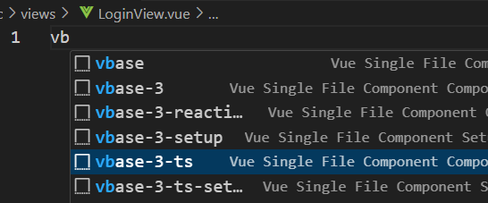

# [Vue3+TS 后台系统项目实战](https://www.bilibili.com/video/BV1nr4y1G73d)

node：`20.14.0`

## 01搭建项目

`npm create vue@latest`

```plaintext
✔ Project name: … vue3-ts-demo-2
✔ Add TypeScript? … No / Yes
✔ Add JSX Support? … No / Yes
✔ Add Vue Router for Single Page Application development? … No / Yes
✔ Add Pinia for state management? … No / Yes
✔ Add Vitest for Unit Testing? … No / Yes
✔ Add an End-to-End Testing Solution? › No
✔ Add ESLint for code quality? … No / Yes
✔ Add Prettier for code formatting? … No / Yes
✔ Add Vue DevTools 7 extension for debugging? (experimental) … No / Yes
```

`npm run dev`

## 02引入element-plus

`npm install element-plus --save`

全量引入

```ts
// main.ts
import './assets/main.css'
import { createApp } from 'vue'

import ElementPlus from 'element-plus'
import 'element-plus/dist/index.css'

import App from './App.vue'
import router from './router'

const app = createApp(App)

app.use(ElementPlus)
app.use(router)

app.mount('#app')
```

按需引入

```sh
npm install -D unplugin-vue-components unplugin-auto-import
```

`vite.config.ts`

```ts
import { fileURLToPath, URL } from 'node:url'

import { defineConfig } from 'vite'
import vue from '@vitejs/plugin-vue'
// element-plus auto import
import AutoImport from 'unplugin-auto-import/vite'
import Components from 'unplugin-vue-components/vite'
import { ElementPlusResolver } from 'unplugin-vue-components/resolvers'

// https://vitejs.dev/config/
export default defineConfig({
  plugins: [
    vue(),
    AutoImport({
      resolvers: [ElementPlusResolver()]
    }),
    Components({
      resolvers: [ElementPlusResolver()]
    })
  ],
  resolve: {
    alias: {
      '@': fileURLToPath(new URL('./src', import.meta.url))
    }
  }
})
```

## 03登录页

### 视图和路由

安装插件：

```plaintext
Id: sdras.vue-vscode-snippets
Description: Snippets that will supercharge your Vue workflow
Version: 3.1.1
Publisher: sarah.drasner
VS Marketplace Link: https://marketplace.visualstudio.com/items?itemName=sdras.vue-vscode-snippets
```

使用代码片段



安装 `scss`：`npm i -D sass`

修改 `router.ts`

```ts
import { createRouter, createWebHistory } from 'vue-router'
import HomeView from '../views/HomeView.vue'
import NotFoundView from '@/views/NotFoundView.vue'

const router = createRouter({
  history: createWebHistory(import.meta.env.BASE_URL),
  routes: [
    {
      path: '/',
      name: 'home',
      component: HomeView
    },
    {
      path: '/about',
      name: 'about',
      component: () => import('../views/AboutView.vue')
    },
    {
      path: '/login',
      name: 'login',
      component: () => import('../views/LoginView.vue')
    },
    {
      path: '/:pathMatch(.*)*',
      name: 'not-found',
      component: NotFoundView
    }
  ]
})

export default router
```

修改 `App.ts`

```vue
<script setup lang="ts">
import { RouterView } from 'vue-router'
</script>

<template>
  <RouterView />
</template>

<style lang="scss">
* {
  padding: 0;
  margin: 0;
}
html,
body,
#app {
  width: 100%;
  height: 100%;
}
</style>
```

### 添加表单组件

添加表单以和校验逻辑

添加类型约束

### 登录逻辑

引入并封装 axios

创建接口

添加登录逻辑，即登录成功后进行跳转

## 04首页布局

### 头部

分为三部分：logo、标题、退出

对齐

### 侧边栏及动态路由

动态路由

默认重定向到 `/index`

根据当前路由做菜单栏自动高亮

## 05商品页

### 搜索区域

### 表格和分页

服务端分页；前端渲染

### 搜索商品功能

## 06用户页

用户包含若干个角色，初始化数据为：

```js
var userList = [
  {
    id: 1,
    nickName: '小明',
    userName: '小明',
    roles: [
      {
        id: 1,
        name: '管理员'
      },
      {
        id: 2,
        name: '普通用户'
      }
    ]
  },
  {
    id: 2,
    nickName: '红红',
    userName: '红红',
    roles: [
      {
        id: 1,
        name: '管理员'
      }
    ]
  },
  {
    id: 3,
    nickName: '绿绿',
    userName: '绿绿',
    roles: [
      {
        id: 2,
        name: '普通用户'
      }
    ]
  }
]

var roleList = [
  {
    name: '管理员',
    id: 1,
    authority: [1, 2, 4, 5, 6, 7, 8, 9, 11, 13, 14, 15, 16]
  },
  {
    name: '普通用户',
    id: 2,
    authority: [1, 3, 4, 6, 7, 8, 9, 11, 12, 13]
  }
]
```

### 搜索区和表格

包含下拉框的搜索区

```vue
<el-form :inline="true" :model="selectData">
    <el-form-item label="昵称">
      <el-input v-model="selectData.nickName" clearable />
    </el-form-item>
    <el-form-item label="角色">
      <el-select v-model="selectData.roleId" size="large" style="width: 240px">
        <!-- 搜索时，如果 roleId=0 则去掉这个条件 -->
        <el-option label="请选择" :value="0" />
        <el-option
          v-for="item in roleList"
          :key="item.id"
          :label="item.name"
          :value="item.id"
        />
      </el-select>
    </el-form-item>
    <el-form-item>
      <el-button type="primary" @click="handleSubmit">搜索</el-button>
    </el-form-item>
</el-form>
```

表格：在角色一列，用插槽展示所有角色信息

```vue
<el-table :data="list" style="width: 100%" :border="true">
  <el-table-column align="center" prop="id" label="ID" width="50"></el-table-column>
  <el-table-column align="center" prop="nickName" label="昵称" width="150"></el-table-column>
  <el-table-column prop="role" label="角色">
    <template #default="scope">
      <div class="roles-container">
        <el-tag v-for="(item, index) in scope.row.roles" :key="index">{{ item.name }}</el-tag>
      </div>
    </template>
  </el-table-column>
</el-table>
```

### 搜索用户功能

### 修改用户信息功能

在弹出对话框中呈现用于修改的表单

## 07角色页

### 添加角色

添加后台接口，前台请求接口添加角色

### 展示角色

### 路由跳转

点击修改角色，会跳转到权限列表页，在这个页面中做角色信息修改

### 权限列表展示

使用树形控件展示角色的权限列表

### 权限列表修改

另外添加修改角色名的功能

如果让我来做，我会把角色信息修改的页面放在[抽屉](https://element-plus.org/zh-CN/component/drawer.html)里

## 08路由守卫和退出登录

退出登录时做二次提示

## 09补充-server.cjs

`server.cjs` 是本人根据 dingding 老师课程讲解的内容设计的一个简单的后台服务，使用 nodejs 环境内置的包，其中包含若干接口：

| 接口路径                | 请求方法 | 补充                                               |
| ----------------------- | -------- | -------------------------------------------------- |
| `/api/login`            | post     | 登录接口                                           |
| `/api/getRoleList`      | get      | 获取所有角色信息                                   |
| `/api/getGoodsList`     | get      | 获取所有商品信息                                   |
| `/api/getUserList`      | get      | 获取所有用户信息                                   |
| `/api/updateUser`       | post     | 修改用户信息                                       |
| `/api/addRole`          | post     | 添加角色                                           |
| `/api/getAuthorityList` | get      | 获取所有权限信息，或根据角色 id 获取对应的权限信息 |
| `/api/updateRole`       | post     | 修改角色信息                                       |

关于 get 请求携带什么查询参数、post 请求携带什么请求体字段，请参考 `server.cjs`
